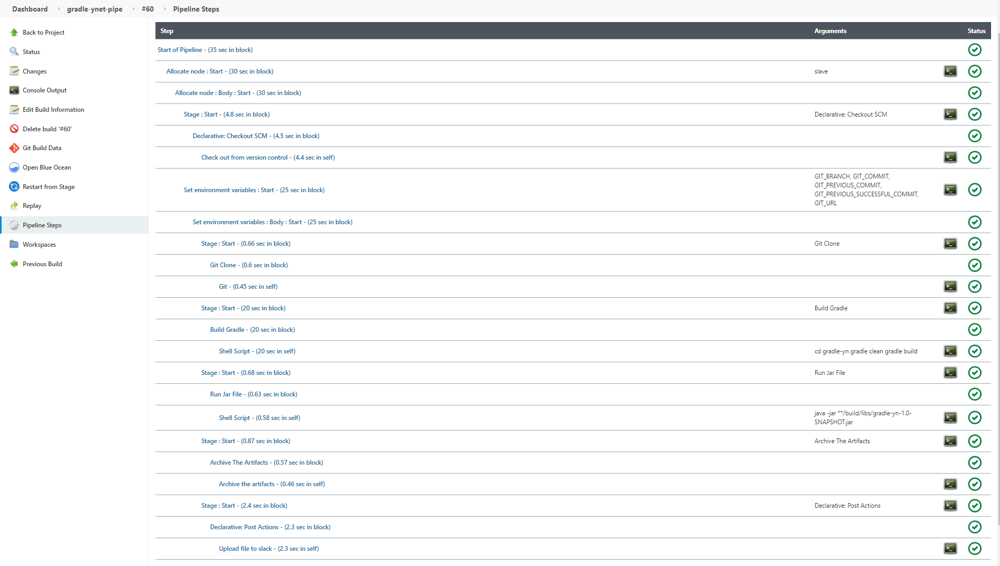
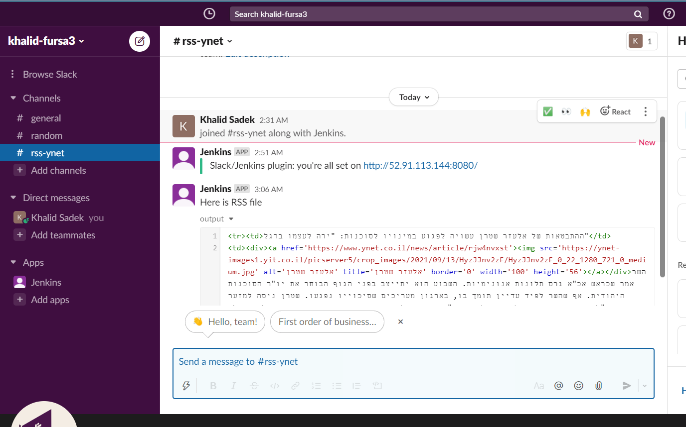

# gradle-java-Ynet

## Authors
Khalid Sadek(Amar)

# Building the Code
## Using Jenkins (version 2.303.2)

# Sending Notification
## using Slack uploadFile

---
* Using AWS ec2 machines (Master and Slave)
* Using Gradle build tool (version 7.2)

